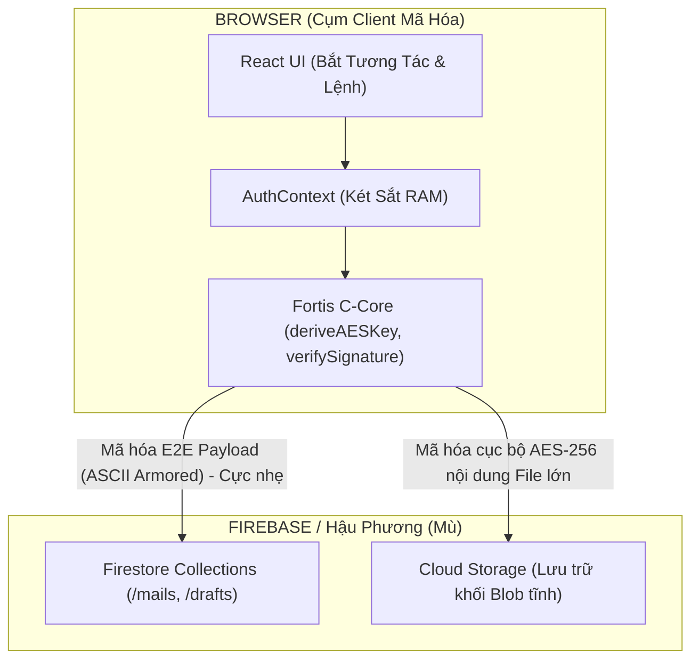

<div align="center">
  
  <h1>FORTISMail - Technical Documentation</h1>
  <p><b>Hệ thống Webmail Doanh nghiệp Zero-Knowledge & Mã hóa Đầu cuối (E2EE)</b></p>
  <p>
    <a href="https://fortis-mail.vercel.app/login">Live Demo</a> •
    <a href="https://github.com/myxxzin/fortis-mail">Repository</a>
  </p>
  <p>
    
    
    
    
    
  </p>
</div>

---

> [!NOTE]
> **FORTISMail** là hệ thống email web mã hóa đầu cuối (E2EE) được xây dựng dựa trên kiến trúc **Zero-Knowledge**. Khác với các hệ thống email phổ thông, máy chủ FORTISMail (Firebase) bị làm "mù" hoàn toàn, chỉ đóng vai trò lưu trữ các chuỗi mã hóa vô nghĩa. Thậm chí nếu toàn bộ database bị lộ hay có sự thâm nhập máy chủ, kẻ tấn công cũng không thể trích xuất được bất kỳ nội dung nào.

## 🚀 1. Bắt Đầu Nhanh (Getting Started)

### Yêu Cầu Nền Tảng (Prerequisites)
- `Node.js >= 18`
- `npm >= 9`
- Tài khoản Firebase khả dụng với Firestore Database và Cloud Storage đã được kích hoạt.

### Cài đặt & Khởi chạy

```bash
# Clone hệ sinh thái
git clone https://github.com/myxxzin/fortis-mail.git

# Mở thư mục & Phân bổ gói cài đặt (Node Modules)
cd fortis-mail
npm install

# Khởi chạy cụm môi trường phát triển
npm run dev
```

### Cấu hình file môi trường (`.env`)
Thiết lập tệp `.env` tại thư mục root và chỉ định các Keys kết nối của bạn:
```env
VITE_FIREBASE_API_KEY=your_key
VITE_FIREBASE_AUTH_DOMAIN=your_domain
VITE_FIREBASE_PROJECT_ID=your_id
VITE_FIREBASE_STORAGE_BUCKET=your_bucket
VITE_FIREBASE_MESSAGING_SENDER_ID=your_sender_id
VITE_FIREBASE_APP_ID=your_app_id
```

> [!CAUTION]
> **Tuyệt đối KHÔNG commit file `.env`.** Việc lộ Keys có thể làm suy yếu hệ thống định tuyến (Dù nội dung vẫn được E2E bảo vệ). Đối với các kỹ sư nội bộ mới onboarding, vui lòng liên hệ trực tiếp cho Tech Lead để được cấp phát chùm key thật trên môi trường Staging/Dev.

---

## 🏗 2. Lõi Kiến Trúc Mật Mã (Cryptography Core)

Hệ thống được vận hành theo mô hình phân tách hai lớp độc lập cực đoan:
* **Tiền phương (Frontend Dashboard):** Trình duyệt hoạt động như một cỗ máy vật lý đảm đương toàn bộ luồng mã hóa (Sử dụng trực tiếp chuẩn `C++ Web Crypto API` lõi của OS).
* **Hậu phương (Firebase Nodes):** Tuyến chuyển phát mù (Blind Courier) không biết mô tê gì về nội dung nó đang phân phối ngoại trừ các UID.



### Các Nền Tảng Thiết Kế Mật Mã Chính
| Giao Thức Kỹ Thuật | Phương Thức Vận Hành | Lý Do Sử Dụng Lõi |
| --- | --- | --- |
| **Mật mã Lai (Hybrid Block)** | Xếp chồng **AES-256-GCM** bên trong **luồng ECDH** | Kết hợp tốc độ chia khối dữ liệu của khối AES, sau đó phong ấn chìa khóa AES nội bộ vô ổ khóa bất đối xứng ECDH để tạo lớp phòng ngự phi điểm y yếu. |
| **Bảo chứng Mật Khẩu (PBKDF2)** | 100,000 Vòng lặp tự Hash | Ngăn chặn các đòn tấn công vét cạn (Brute-force) bằng dàn ASIC rigs chuyên dụng. Đưa chi phí giải thuật phá khóa lên ngưỡng bất khả thi tài chính. |
| **Forward Secrecy (Khóa rụng)** | Ephemeral ECDH (Tạo 1 lần hủy 1 lần) | Đảm bảo tính chống truy hồi: Nếu 10 năm sau Private Key lõi bị đánh cắp, toàn bộ email trao đổi ở quá khứ vẫn an toàn 100% nhờ việc khóa phiên giao tiếp đã bị đốt cháy ngay sau khi hoàn thành. |
| **Khóa chết Packet** | Chữ ký điện tử ECDSA | Không chỉ ký nội dung chữ, chữ ký số kiểm sát trực tiếp `Timestamp` và `RecipientID`. Chặn đứng ngay tức khắc mọi vụ bắt gói tin cũ phát lại (Replay Attacks). |

---

## 💾 3. Hệ Thống Lưu Trữ & Vượt Rào Phân Mảnh

Cơ sở dữ liệu Firestore được định tuyến thông qua ba tập con Collection hoàn toàn bị cắt đứt vật lý với nhau, **không tồn tại khái niệm JOIN key**. Thiết kế này triệt tiêu hoàn toàn khả năng rò rỉ chéo và dồn trọn năng lực Read Pipeline cho tốc độ truy hồi tốc độ cao.

### Lách luật hạn mức 1MB của Firestore (Cloud Attachment Bypass)
Vì nguyên lý Firestore khóa cứng giới hạn 1MB/nhánh (Document max size), cơ chế *Cloud Attachment Split* của chúng tôi giải quyết file đính kèm lớn như sau:

1. **Khởi tạo Key tạm (Ephemeral File Key):** Trình duyệt vắt ra 1 khóa AES-256 RNG nội bộ bọc ngay toàn bộ Byte Array thô của file vừa upload.
2. **Ký gửi Blob mù:** Vứt khối Blob đã mã hóa cứng ngắc lên Firebase/Cloud Storage và thu về 1 liên kết trỏ tĩnh `[URL]`.
3. **Mã hóa E2E Routing:** Nắm chùm con trỏ `[URL]` cùng `AES-File-Key` và đẩy vô luồng bọc E2EE chung của bức thư. 
➡ _Kết quả: Firestore duy trì tốc độ đọc siêu nhẹ (Vài Bytes tĩnh), Storage gánh Data thô vô não._

---

## 🛡 4. UX Bảo Mật & 5 Lệnh Phạt Máu (Iron Laws)

FORTISMail khai trừ mọi thư viện Redux State (*Kiên quyết cấm Redux*) để tránh việc RAM bị các thành phần mở rộng thứ 3 đào bới. Song song với đó, hệ thống vĩnh viễn tẩy chay lối thoát hiểm **"Quên Mật Khẩu"** - hễ quên là mất trắng thư viện lịch sử, nhằm chặt đứt hoàn toàn Zero-Day attack surface từ việc mạo danh recovery form.

> [!WARNING]  
> Bất kỳ kỹ sư/dev nào sửa đổi mã nguồn nếu vi phạm 1 trong 5 quy tắc máu này sẽ làm phá vỡ tức khắc hàng rào Zero-Knowledge. Lỗi có thể không hiện trên Terminal, nhưng dữ liệu của sinh mạng User sẽ lập tức lâm nguy.

1. **🔥 Luật 1: Nghiêm cấm Console Logging Key.** Không dùng `console.log()` lên các Variables chứa thông tin Private Key/Session Key. Hacker luôn có plugin theo dõi `window.console` mọi lúc.
2. **🔥 Luật 2: Cấm thay thế Web Crypto gốc.** Tẩy chay 100% các bộ NPM Package như `crypto-js`. Tránh hoàn toàn nguy cơ chèn mã lậu đợt từ **Supply Chain attacks**. Bắt buộc vận dụng hàm Ruột C++ `window.crypto.subtle`.
3. **🔥 Luật 3: Sanitize DOM mức tối đa.** Tuyệt đối không dùng `dangerouslySetInnerHTML`. Bất kỳ lỗi hớ hênh nào trong việc Rendering DOM Text đều mở đường cho Script dơ lọt vào moi sạch RAM Keys.  
4. **🔥 Luật 4: Tracking Analytics = Kẻ phản bội.** Không chèn script Google Analytics, Meta Pixel hay Hotjar. Các nền tảng này hoạt động bằng cách quét DOM hiển thị để lập biểu đồ. Ngay khi thư vừa giải mã hiển thị trên màn hình, tụi nó sẽ lén lút bê chữ cái thô sơ chép về máy chủ của tụi nó - Phá vỡ trọn vẹn lớp E2E.
5. **🔥 Luật 5: Sự bốc hơi thuần khiết (Volatile State).** Mọi dữ liệu đã cởi lớp mã không được phép in dấu xuống ổ cứng vật lý. Tắt Tab là dọn RAM. Tuyệt đối không xài LocalStorage / SessionStorage / Cookies cho việc lưu bản thô.

---

## 🗂 5. Cơ Cấu Sinh Thái Kỹ Thuật Dự Án

> [!IMPORTANT]
> Toàn bộ logic định đoạt sinh mạng hệ thống gói gọn tại tập tin `src/utils/cryptoAuth.ts`. Dev non tay tuỳ tiện thay đổi tham số cắt ArrayBuffer bên trong có khả năng làm loạn format mã hóa dẫn tới hàng ngàn user văng lỗi "Tập tin bị ngụy tạo hoặc hỏng mã" ở khâu giải mã!

```directory
secure-webmail/
 ├── src/
 │    ├── utils/    
 │    │    └── cryptoAuth.ts      # ⚠️ TRÁI TIM — Luồng mật mã hóa tổng. Nguy hiểm cực đại!
 │    ├── context/               
 │    │    └── AuthContext.tsx    # Chốt khóa nắm con trỏ ghim Private Key RAM.
 │    ├── pages/
 │    │    ├── Compose.tsx        # ✉️ Tầng soạn thảo & Gói phong ấn Crypto
 │    │    └── DecryptMsg.tsx     # 🔓 Cỗ máy róc vỏ giải mã & Kiểm định ECDSA 
 │    └── ... (Các UI/UX Modules khác)
```

<br/>
<div align="center">
  <sub>Sáng tác cho hệ sinh thái mở <b>FORTISMail</b> • Thiết kế cho các kỹ sư tôn sùng Quyền Riêng Tư.</sub>
</div>
