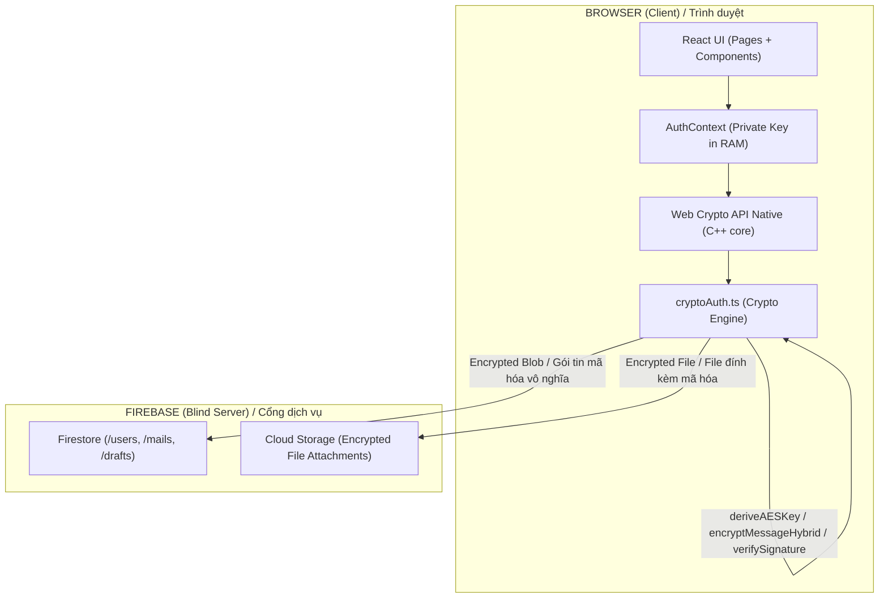

# 🔐 FORTISMail — Developer Onboarding Documentation
# 🔐 FORTISMail — Tài Liệu Onboarding Developer

> **Version:** 1.0.0 | **Stack:** React 19 + TypeScript + Vite + Firebase | **Bilingual:** VI/EN

---

## Table of Contents / Mục Lục

1. [Project Overview / Tổng Quan Dự Án](#1-project-overview--tổng-quan-dự-án)
2. [Architecture / Kiến Trúc Hệ Thống](#2-architecture--kiến-trúc-hệ-thống)
3. [Cryptography Core / Lõi Mật Mã Học](#3-cryptography-core--lõi-mật-mã-học)
4. [Repository Structure / Cấu Trúc Thư Mục](#4-repository-structure--cấu-trúc-thư-mục)
5. [Data Storage Design / Thiết Kế Lưu Trữ](#5-data-storage-design--thiết-kế-lưu-trữ)
6. [Security UX Patterns / Bảo Mật UX](#6-security-ux-patterns--bảo-mật-ux)
7. [Getting Started / Bắt Đầu Dự Án](#7-getting-started--bắt-đầu-dự-án)
8. [The 5 Iron Laws / 5 Quy Tắc Máu](#8-the-5-iron-laws--5-quy-tắc-máu)
9. [Role Assignment / Phân Chia Vai Trò](#9-role-assignment--phân-chia-vai-trò)

---

## 1. Project Overview / Tổng Quan Dự Án

### EN
FORTISMail is a **Zero-Knowledge, End-to-End Encrypted (E2EE) web mail application**. Unlike conventional email systems where the server can read message content, FORTISMail ensures that only the sender and the intended recipient can ever decrypt a message. The server (Firebase) stores only meaningless ciphertext — even a full database breach yields nothing readable.

Key differentiators:
- All cryptographic computation happens **client-side** in the browser
- Messages are **personalized** (dynamic recipient name, content variables, templates)
- The backend is intentionally "blind" — it routes encrypted blobs, nothing more
- Built on **native Web Crypto API** (`window.crypto.subtle`), not third-party npm crypto libraries

### VI
FORTISMail là một **ứng dụng email web mã hóa đầu cuối (E2EE) theo kiến trúc Phi Tri Thức (Zero-Knowledge)**. Khác với các hệ thống email thông thường, máy chủ FORTISMail không thể đọc nội dung thư — Firebase chỉ lưu trữ các chuỗi mã hóa vô nghĩa, kể cả khi toàn bộ database bị xâm phạm, tin tặc cũng không đọc được gì.

Điểm khác biệt cốt lõi:
- Toàn bộ tính toán mật mã diễn ra **phía client** trong trình duyệt
- Thư được **cá nhân hóa** (tên người nhận động, biến nội dung, template)
- Backend cố ý bị "làm mù" — chỉ định tuyến blob mã hóa, không hơn
- Xây dựng trên **Web Crypto API gốc** (`window.crypto.subtle`), không dùng thư viện npm mã hóa bên thứ 3

---

## 2. Architecture / Kiến Trúc Hệ Thống

### System Flow / Luồng Hệ Thống
*(Mermaid Diagram generates a visual chart in GitHub, Notion, etc.)*



**Two-layer model / Mô hình hai lớp:**
- **Frontend** = Encryption Engine. The browser acts as a dedicated encryption server. *(Máy mã hóa. Trình duyệt đóng vai trò một máy chủ mã hóa chuyên dụng).*
- **Backend** = Dumb Courier. Firebase receives opaque encrypted blobs and routes them by UID. It computes nothing. *(Tuyến chuyển phát câm. Firebase nhận blob mã hóa mờ đục và định tuyến theo UID. Không tính toán bất cứ điều gì).*

---

## 3. Cryptography Core / Lõi Mật Mã Học

> **Source file / File nguồn:** `src/utils/cryptoAuth.ts`

### 3.1 Hybrid Cryptography Model / Mô Hình Mật Mã Lai

#### EN
FORTISMail uses a **Hybrid Cryptography** approach, combining the speed of symmetric encryption with the key-exchange safety of asymmetric encryption:

```
ENCRYPT FLOW:
──────────────────────────────────────────────────────
Message Content (large)
        │
        ▼
  AES-256-GCM  ──── generates ────▶  [AES File Key]
  (fast, bulk)                              │
        │                                   ▼
  [Ciphertext]                    ECDH (Ephemeral Key)
                                  wraps [AES File Key]
                                          │
                                          ▼
                                  [Encrypted Key Blob]
                                  (safe to transmit)
──────────────────────────────────────────────────────
Final payload = Ciphertext + Encrypted Key Blob
```

#### VI
FORTISMail dùng **Mật mã Lai (Hybrid Cryptography)**, kết hợp tốc độ của mã hóa đối xứng với tính an toàn trao đổi khóa của mã hóa bất đối xứng.

---

### 3.2 `deriveAESKey()` — Password Hardening / Làm Cứng Mật Khẩu

#### EN
- **What:** Takes a human-readable password + user-specific salt → produces a 256-bit AES Master Key
- **Why PBKDF2 with 100,000 iterations:** Standard SHA-256 is too fast — ASIC rigs can attempt billions of guesses/second. Forcing 100,000 self-hash rounds means each guess costs ~0.2s. Negligible for a real user logging in; computationally impossible for brute-force attacks.
- **Purpose:** This Master Key wraps the user's Private Key before it is stored in Firestore

#### VI
- **Làm gì:** Nhận mật khẩu người dùng + salt định danh → sinh ra AES Master Key 256-bit
- **Tại sao PBKDF2 với 100,000 vòng:** SHA-256 thông thường quá nhanh — máy ASIC có thể thử hàng tỷ mật khẩu/giây. Ép 100,000 vòng tự băm nghĩa là mỗi lần thử tốn ~0.2s. Không đáng kể với user thực; bất khả thi về mặt kinh tế với tấn công brute-force.
- **Mục đích:** Master Key này bọc Private Key của user trước khi lưu lên Firestore

---

### 3.3 `encryptMessageHybrid()` — Ephemeral ECDH + Forward Secrecy

#### EN
- **What:** Generates a one-time ephemeral key pair for each message sent
- **Why ephemeral (not reusing the sender's permanent Private Key):**

```
WITHOUT Ephemeral Keys:
  Alice's permanent PrivKey + Bob's PubKey → Session Key
  ❌ If Alice's PrivKey is stolen 10 years later,
     ALL past emails can be retroactively decrypted.

WITH Ephemeral Keys (FORTISMail):
  Random one-time PrivKey + Bob's PubKey → Session Key
  ✅ Ephemeral key is destroyed immediately after encryption.
     Even if Alice's main key is later compromised,
     past session keys can NEVER be reconstructed.
```

- **This property is called Forward Secrecy** — past communications remain secure even if long-term keys are later exposed.

#### VI
- **Làm gì:** Sinh một cặp khóa tạm thời (ephemeral) dùng một lần duy nhất cho mỗi thư gửi đi
- **Tại sao dùng khóa tạm thời:** Đảm bảo **Forward Secrecy** — dù Private Key chính bị lộ sau này, toàn bộ thư cũ vẫn không thể giải mã vì khóa phiên tạm thời đã tự hủy ngay sau khi mã hóa xong.

---

### 3.4 `verifySignature()` — Anti-Replay Attack

#### EN
- **What:** Every outgoing message is digitally signed with the sender's Private Key (ECDSA)
- **Why the signature covers Timestamp + Recipient (not just content):**
  - Signing only content allows a replay attack: an intercepted old message can be re-forwarded
  - By including `timestamp` and `recipientUID` in the signed payload, any tampering with time or routing causes ECDSA verification to **immediately fail**
  - Result: forged, replayed, or misdirected messages are cryptographically rejected

#### VI
- **Làm gì:** Mỗi thư gửi đi được ký số bằng Private Key của người gửi (ECDSA)
- **Tại sao ký cả Timestamp + Recipient:** Nếu chỉ ký nội dung, kẻ xấu có thể tóm gói tin cũ, sửa thời gian và chuyển tiếp lại (replay attack). Khi chữ ký bao gồm cả `timestamp` và `recipientUID`, chỉ cần 1 bit sai, xác thực ECDSA thất bại ngay lập tức.

---

### 3.5 Why React Context, Not Redux / Tại Sao Dùng Context Thay Vì Redux

#### EN

| Factor | Redux | React Context (FORTISMail) |
|---|---|---|
| State visibility | Centralized, inspectable via DevTools | Isolated, not exposed to window |
| Private Key exposure risk | HIGH — DevTools/extensions can extract State Tree | LOW — key lives as volatile object, destroyed on tab close |
| Security model fit | ❌ Poor for E2EE secrets | ✅ Purpose-built for volatile key storage |

The **Decrypted Private Key must live in RAM** to decrypt messages in real time. If it sits in Redux, any browser extension scanning `window.__REDUX_STORE__` can extract it. AuthContext keeps it isolated — closing the tab or refreshing the page destroys it permanently.

#### VI

Private Key đã giải mã phải tồn tại trên RAM để giải mã thư theo thời gian thực. Nếu để trong Redux, bất kỳ extension trình duyệt nào quét `window.__REDUX_STORE__` đều có thể trích xuất. AuthContext giữ nó cô lập — đóng tab hoặc F5 là khóa bị hủy vĩnh viễn.

---

### 3.6 Key Lifecycle & Revocation / Vòng Đời Khóa & Khôi Phục

#### EN
- **What happens if a user forgets their password?** There is **NO "Forgot Password" functionality**.
- **Why:** The server holds no secrets. Since the Master Key is derived computationally from the user's password, losing the password means losing the ability to decrypt the Private Key. All previously encrypted messages become permanently inaccessible. Eliminating password resets prevents hackers from exploiting external recovery loopholes.

#### VI
- **Quên mật khẩu thì sao?** Ứng dụng **KHÔNG có khái niệm "Quên mật khẩu"**.
- **Tại sao:** Server không chứa bản gốc của bất cứ bí mật nào. Vì Master Key sinh ra từ mật khẩu của bạn, mất mật khẩu đồng nghĩa với việc mất vĩnh viễn quyền giải mã Private Key. Toàn bộ thư từ trước đó trở thành rác. Loại bỏ tính năng khôi phục mật khẩu là cách tuyệt đối để chặn đứng hoàn toàn việc hacker lợi dụng lỗ hổng khôi phục để chiếm đoạt tài khoản.

---

## 4. Repository Structure / Cấu Trúc Thư Mục

```
secure-webmail/
├── public/                    # Static assets
├── src/
│   ├── assets/                # Images, icons
│   ├── components/            # Reusable UI components
│   ├── config/                # Firebase config, app constants
│   ├── context/               # AuthContext (Private Key RAM isolation)
│   ├── contexts/              # Additional React contexts
│   ├── layouts/               # Page layout wrappers
│   ├── locales/
│   │   ├── en.ts              # English i18n strings
│   │   └── vi.ts              # Vietnamese i18n strings
│   ├── pages/
│   │   ├── docs/              # Internal documentation pages
│   │   ├── AboutUs.tsx
│   │   ├── Compose.tsx        # ✉️ Compose new encrypted message
│   │   ├── Contacts.tsx       # 👥 Contact list with Public Keys
│   │   ├── DecryptMsg.tsx     # 🔓 Decrypt & read received message
│   │   ├── Docs.tsx
│   │   ├── Drafts.tsx         # 📝 Auto-saved encrypted drafts
│   │   ├── Inbox.tsx          # 📥 Encrypted inbox
│   │   ├── Landing.tsx        # 🏠 Landing page
│   │   ├── Login.tsx          # 🔑 Login + key derivation
│   │   ├── Register.tsx       # 📋 Register + keypair generation
│   │   └── Sent.tsx           # 📤 Sent messages
│   └── utils/
│       └── cryptoAuth.ts      # ⚠️ CORE — All cryptographic operations
├── package.json
├── vite.config.ts
├── tsconfig.json
├── vercel.json                # Deployment config
└── WHITEPAPER.md              # Architecture deep-dive
```

### Key Files / File Quan Trọng

| File | Role / Vai Trò |
|---|---|
| `src/utils/cryptoAuth.ts` | ⚠️ **Heart of the app.** All ECDH, AES, PBKDF2, ECDSA logic |
| `src/context/` | Private Key isolation via React Context |
| `src/pages/Compose.tsx` | Encrypt + sign + send flow |
| `src/pages/DecryptMsg.tsx` | Decrypt + verify signature flow |
| `src/pages/Register.tsx` | Keypair generation + PBKDF2 key wrapping |

---

## 5. Data Storage Design / Thiết Kế Lưu Trữ

### 5.1 Firestore Collections

#### EN
Three independent collections with **no physical JOIN keys** between them (intentional — maximizes NoSQL fetch speed and minimizes data leakage surface):

#### VI
Ba collection độc lập, **không có JOIN key vật lý** giữa chúng (cố ý — tối đa hóa tốc độ fetch NoSQL và giảm thiểu bề mặt rò rỉ dữ liệu):

```
Firestore
├── /users/{uid}
│   ├── alias          (display name / tên hiển thị)
│   ├── publicKey      (public key — shared openly / khóa công khai)
│   └── pinHash        (hashed PIN — never plaintext / PIN đã băm)
│
├── /mails/{mailId}
│   ├── to             (recipient UID)
│   ├── from           (sender UID)
│   ├── encryptedPayload   (ASCII Armored ciphertext)
│   ├── encryptedKey   (ECDH-wrapped AES key)
│   ├── signature      (ECDSA signature)
│   └── timestamp
│
└── /drafts/{draftId}
    ├── ownerUID
    ├── encryptedContent
    └── lastSaved
```

### 5.2 Large File Attachments (Bypassing 1MB Firestore Limit)

#### EN
Firestore enforces a strict **1MB per document** limit. FORTISMail handles large attachments via a split-layer approach:

```
ATTACHMENT FLOW:
────────────────────────────────────────────────────────
1. Browser generates AES-File-Key (random, one-time)
2. File Blob is encrypted with AES-File-Key
3. Encrypted Blob → Cloud Storage → returns [static URL]
4. Browser takes [URL] + [AES-File-Key]
   └──▶ packages both into the email Payload
5. Full email Payload (now small, text-only) is E2E encrypted
6. Tiny Payload pushed to Firestore
────────────────────────────────────────────────────────
Result:
  Cloud Storage  = large, meaningless encrypted blobs
  Firestore      = small, routable encrypted keys + metadata
```

#### VI
Cloud Storage gánh tải dữ liệu lớn vô nghĩa; Firestore chỉ định tuyến các key nhỏ gọn. Hai lớp bổ sung nhau để xây dựng E2EE không giới hạn kích thước.

---

## 6. Security UX Patterns / Bảo Mật UX

### 6.1 App-Level PIN Lock / Khóa PIN Cấp Ứng Dụng

#### EN
- On first setup, user configures a 6-digit PIN
- PIN hash is stored (never the PIN itself)
- When user taps to open a message, a **Gatekeeper Overlay** locks the UI
- PIN entry → hash match (~10ms) → overlay drops → message decrypted from RAM
- **Why not LocalStorage?** Browser extensions can read LocalStorage. The decrypted Private Key lives only in React Context RAM — never persisted to disk.

#### VI
- Khi mở thư, màn hình **Gatekeeper Overlay** chặn UI, yêu cầu nhập 6 số PIN
- Khớp hash (~10ms) → màn hình rớt xuống → giải mã thư từ RAM
- **Tại sao không dùng LocalStorage?** Extension trình duyệt có thể đọc LocalStorage. Private Key đã giải mã chỉ sống trong RAM của React Context — không bao giờ lưu xuống đĩa.

---

### 6.2 Debounced Auto-Save Drafts / Tự Động Lưu Nháp Với Debounce

#### EN
- Drafts use a `setTimeout` debounce flag via `useRef` — **3000ms delay**
- **Why debounce?** E2EE operations (AES keygen, ECDSA sign, Base64 encode) are CPU-intensive. Without delay, every keystroke triggers a full encrypt cycle, causing:
  - Browser CPU spike / browser freezes
  - Excessive Firestore write operations (Firebase billing scales per read/write)
- The 3-second debounce batches all keystrokes into one single encrypt-and-write cycle

#### VI
- Debounce 3000ms: đợi người dùng ngừng gõ 3 giây mới thực hiện một chu kỳ mã hóa và ghi
- Không có delay: mỗi phím gõ kích hoạt một chu kỳ AES + ECDSA đầy đủ → CPU spike + chi phí Firebase billing tăng vọt

---

## 7. Getting Started / Bắt Đầu Dự Án

### Prerequisites / Yêu Cầu

```bash
Node.js >= 18
npm >= 9
A Firebase project with Firestore + Storage enabled
```

### Install / Cài Đặt

```bash
git clone https://github.com/myxxzin/fortis-mail.git
cd fortis-mail
npm install
```

### Environment Variables / Biến Môi Trường

Create / Tạo file `.env` at root:

```env
VITE_FIREBASE_API_KEY=
VITE_FIREBASE_AUTH_DOMAIN=
VITE_FIREBASE_PROJECT_ID=
VITE_FIREBASE_STORAGE_BUCKET=
VITE_FIREBASE_MESSAGING_SENDER_ID=
VITE_FIREBASE_APP_ID=
```

> ⚠️ **IMPORTANT:** Never commit the `.env` file to version control. Request the actual keys from the Tech Lead.
> ⚠️ **QUAN TRỌNG:** Tuyệt đối không commit file `.env` lên git. Đối với người mới, vui lòng liên hệ Tech Lead để được cấp các key thực tế thay vì tự tìm kiếm.

### Run Dev / Chạy Dev

```bash
npm run dev
```

### Build / Build Production

```bash
npm run build
```

### Deploy / Deploy

```bash
# Configured for Vercel via vercel.json
vercel deploy
```

---

## 8. The 5 Iron Laws / 5 Quy Tắc Máu

> ⚠️ These rules are **non-negotiable**. Violating any one of them can silently break the entire Zero-Knowledge security model.
> ⚠️ Các quy tắc này **không thể thương lượng**. Vi phạm bất kỳ quy tắc nào có thể âm thầm phá vỡ toàn bộ mô hình bảo mật Zero-Knowledge.

---

### ❌ Law 1 — Never log keys to console / Không log key ra console

```typescript
// ❌ FORBIDDEN — in ANY environment, dev or prod
console.log(privateKey)
console.log(decryptedContent)
alert(sessionKey)

// ✅ CORRECT
// Use opaque references only. Never materialize key values in logs.
```

**Why / Tại sao:** Malicious browser extensions actively scan console output for key-shaped strings.
Extension độc hại chủ động quét console output để tìm chuỗi trông giống key.

---

### ❌ Law 2 — Never replace `window.crypto` with npm crypto libraries / Không thay thế Web Crypto bằng thư viện npm

```typescript
// ❌ FORBIDDEN
import CryptoJS from 'crypto-js'   // Supply chain attack vector
import forge from 'node-forge'

// ✅ CORRECT
window.crypto.subtle.encrypt(...)  // Native C++ browser engine
```

**Why / Tại sao:** npm packages can be compromised (supply chain attack). `window.crypto.subtle` is compiled into the browser binary and cannot be tampered with via npm.

---

### ❌ Law 3 — Always sanitize DOM output / Luôn lọc đầu ra DOM

```typescript
// ❌ FORBIDDEN — raw user content injected into DOM
element.innerHTML = userContent

// ✅ CORRECT
element.textContent = userContent   // or use DOMPurify
```

**Why / Tại sao:** Unsanitized DOM injection enables XSS attacks — a script injected into the mail body could exfiltrate decrypted content from RAM.

---

### ❌ Law 4 — Maintain Content Security Policy / Giữ nguyên Content Security Policy

```
# In vercel.json — do NOT relax these headers:
X-Frame-Options: DENY
Content-Security-Policy: (no external JS injection)
```

**Why / Tại sao:** Tools like Google Tag Manager read DOM content and send it to ad analytics servers — including plaintext that hasn't yet been encrypted. Never inject third-party JS into an E2EE app.

---

### ❌ Law 5 — Never persist decrypted material to storage / Không lưu tài liệu đã giải mã xuống storage

```typescript
// ❌ FORBIDDEN
localStorage.setItem('privateKey', decryptedKey)
sessionStorage.setItem('message', plaintext)
document.cookie = `key=${privateKey}`

// ✅ CORRECT
// All decrypted material lives ONLY in React state / Context RAM.
// It is destroyed automatically on tab close or page refresh.
```

**Why / Tại sao:** Any form of browser storage (localStorage, sessionStorage, cookies) is accessible to extensions and persists across sessions. Decrypted secrets must be ephemeral — RAM only.

---

## 9. Role Assignment / Phân Chia Vai Trò

| Role / Vai Trò | Responsibilities / Trách Nhiệm |
|---|---|
| **Senior Fullstack (Tech Lead)** | Architecture, `cryptoAuth.ts` ownership, API contracts, CI/CD, unblock team |
| **Mid Frontend** | Inbox/Sent/Drafts UI, state management, routing, auth guards |
| **Mid Backend** | Firebase rules, Firestore schema, Cloud Storage integration, delivery (Resend) |
| **Mid UI/UX** | Figma → components, rich text editor (TipTap), template system, design system |
| **Mid Security** | E2EE flow audit, E2E testing (Playwright), pentest (OWASP), CSP policy |
| **Mid Mobile** | PWA setup, Service Worker, offline support, Lighthouse performance optimization |

---

## Appendix — Tech Stack Summary / Tóm Tắt Tech Stack

| Layer | Technology |
|---|---|
| Frontend Framework | React 19 + TypeScript |
| Build Tool | Vite 8 |
| Styling | Tailwind CSS 4 |
| Routing | React Router DOM 7 |
| Animation | Framer Motion |
| Cryptography | `window.crypto.subtle` (Web Crypto API) |
| Icons | Lucide React |
| Notifications | React Hot Toast |
| Onboarding Tours | Driver.js |
| Backend / DB | Firebase Firestore + Cloud Storage |
| Auth | Firebase Auth |
| Deployment | Vercel |
| i18n | Custom (en.ts / vi.ts) |

---

*Generated for FORTISMail v1.0.0 — fortismail.com*
*Tài liệu được tạo cho FORTISMail v1.0.0 — fortismail.com*